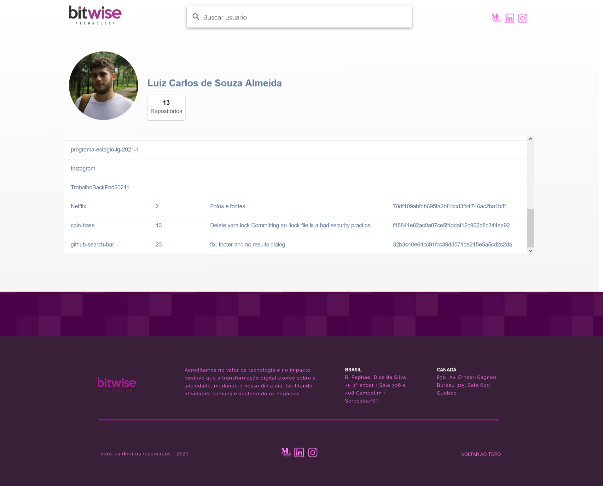

# GitHub Search Bar

Interface com barra de busca utilizando a API GitHub GraphQL, para listar os repositórios do usuário e algumas informações.

Você pode testar a aplicação aqui: [luizcarlos-github-search-bar.netlify.app](luizcarlos-github-search-bar.netlify.app)

## Instalação

Para rodar o projeto primeiro faça o clone do repositório:

    git clone https://github.com/LuizCarlosdeSouzaAlmeida/github-search-bar.git  

Na pasta `github-search-bar` altere o arquivo `.env` com [Sua chave da API do GitHub](https://docs.github.com/pt/authentication/keeping-your-account-and-data-secure/creating-a-personal-access-token) e então com o node rode:

    npm run dev
    ou
    yarn dev

## Recursos

- Vite
- Vue 3
- Vuetify 3
- Vue Router 4
- Pinia
- Eslint
- Prittier
- Apollo
- Github Api
- Graphql
- Netlify

## Proximos passos

- Testes unitários com vitest + @vue/testing-libry (encontrado um problema de integração do vitest com o vuetify 3)
- Responsividade
- Internacionalização i18n
- Acessibilidade a11y

## Imagens

  